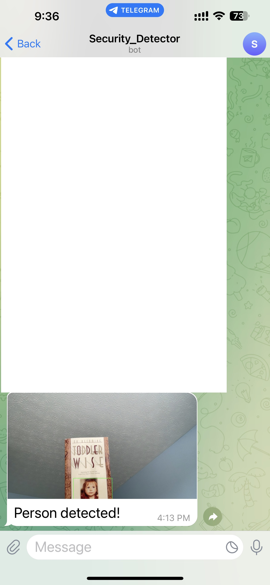

# human-detector
A live human detector with free Telegram notification to your phone.

# Background
Getting notifications from a live human detector (which can be used as a security camera system) is not always free. This program is to establish a service from the popular free cloud-based instant messaging tool - `Telegram`.

# Preparation
Using a Telegram bot to send notifications is a straightforward process. 

Here's how you can set up a Telegram bot and obtain the token and chat_id:

1. Download `Telegram` app on your phone
2. Create a Telegram Bot:
   1. Start a chat with BotFather:
      1. Open your Telegram app.
      2. Search for "BotFather" and start a chat with it.
   2. Create a new bot:
      1. Send /newbot to BotFather.
      2. Follow the prompts. BotFather will ask you for a name and username for your bot.
      3. Once the bot is created, BotFather will provide you with a token. This is your bot token. Make sure to save it.
3. Get your chat_id:
   1. Start a chat with your new bot:
   2. In the Telegram app, search for the username you assigned to your bot and start a chat with it.
4. Start a chat with another bot called IDBot:
   1. Search for "IDBot" and start a chat with it.
   2. Send /getid to IDBot.
   3. IDBot will send you your personal chat_id.

Once you have both the bot token and the chat_id, you can update the variables in `telegram_token_chatid.json` to trigger the Telegram notification.

# Execution
python detector.py

The captured images and videos will be stored locally. Also, a notification with the captured image will be sent to your phone via `Telegram`.

Here is a snapshot from `Telegram`:

